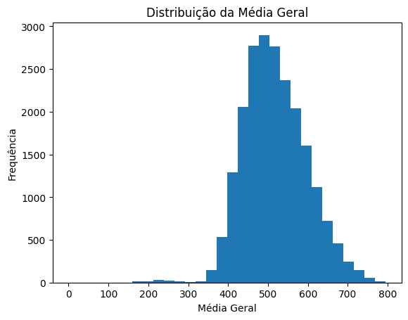
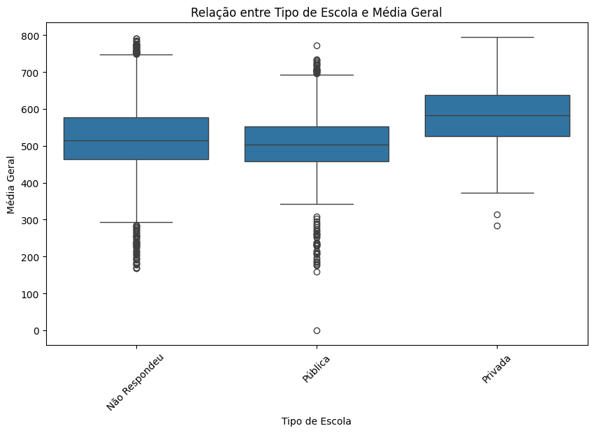
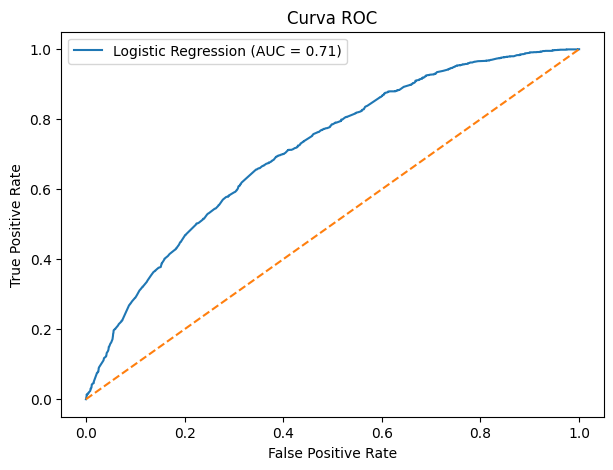
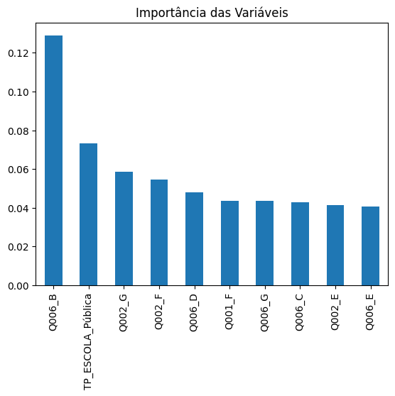

# Projeto em parceria com a Semantix

# Predição de Baixo Desempenho no ENEM
### Uma análise de fatores socioeconômicos e educacionais

## Contexto do Problema

A desigualdade educacional é um desafio estrutural no Brasil e impacta diretamente o desempenho acadêmico dos estudantes. O ENEM (Exame Nacional do Ensino Médio) é uma das principais formas de acesso ao ensino superior no país e, por isso, compreender os fatores que influenciam o baixo desempenho é fundamental.

Este projeto busca responder à seguinte pergunta:

**Quais fatores estão mais associados ao baixo desempenho no ENEM e como podemos identificar estudantes com maior risco de baixo rendimento?**

---

## Objetivo

Utilizar análise de dados e Machine Learning para identificar padrões associados ao baixo desempenho acadêmico, permitindo compreender quais fatores socioeconômicos e educacionais possuem maior influência nos resultados.

---

## Fonte de Dados

Os dados utilizados são públicos e foram extraídos dos **Microdados do ENEM 2023**, disponibilizados pelo INEP.

Base oficial:

- Instituto Nacional de Estudos e Pesquisas Educacionais Anísio Teixeira (INEP)

### Variáveis selecionadas:

- Notas das provas objetivas
- Nota da redação
- Renda familiar (`Q006`)
- Escolaridade do pai (`Q001`)
- Escolaridade da mãe (`Q002`)
- Tipo de escola (`TP_ESCOLA`)

---

## Coleta e Tratamento de Dados

O processo de preparação incluiu:

- Seleção de 28 colunas relevantes
- Remoção de variáveis com alta quantidade de dados ausentes (>75%)
- Tratamento de valores nulos
- Criação da variável **MEDIA_GERAL**
- Criação da variável target **BAIXO_DESEMPENHO**

A variável target foi construída a partir da média geral do aluno:

- **0** = desempenho acima da mediana
- **1** = baixo desempenho (abaixo da mediana)

O balanceamento final ficou próximo de 50/50, permitindo uma modelagem mais equilibrada.

---

## Análise Exploratória de Dados (EDA)

A análise exploratória revelou padrões importantes:

### Principais achados:

- Estudantes com maior renda familiar apresentaram melhor desempenho médio.
- Maior escolaridade dos pais esteve associada a melhores notas.
- Alunos de escolas privadas apresentaram desempenho superior em relação aos de escolas públicas.

Esses resultados reforçam a influência do contexto socioeconômico no desempenho educacional.

---

## Modelagem

Foram treinados três modelos de classificação:

- Regressão Logística
- Random Forest
- XGBoost

### Etapas da modelagem:

- One-Hot Encoding
- Train/Test Split
- Treinamento dos modelos
- Avaliação com métricas de classificação
- Curva ROC
- Matriz de confusão
- Importância das variáveis

---

## Resultados

### Comparação dos modelos

| Modelo | Accuracy | F1-score |
|---|---:|---:|
| Regressão Logística | 0.67 | 0.68 |
| Random Forest | 0.66 | 0.68 |
| XGBoost | 0.66 | 0.68 |

A **Regressão Logística apresentou o melhor desempenho geral**, superando modelos mais complexos.

Esse resultado sugere que as relações entre as variáveis analisadas e o baixo desempenho possuem comportamento relativamente linear.

---

## Visualizações

### Distribuição da Média Geral



---

### Relação entre Renda Familiar e Média Geral


---

### Tipo de Escola e Desempenho



---

### Curva ROC dos Modelos



---

### Importância das Variáveis



---

## Conclusões

Os resultados mostraram que fatores socioeconômicos e educacionais possuem forte relação com o desempenho no ENEM.

As variáveis mais relevantes foram:

- Renda familiar
- Escolaridade da mãe
- Tipo de escola

Mesmo utilizando modelos mais complexos como Random Forest e XGBoost, a Regressão Logística apresentou melhor desempenho, indicando que um modelo mais simples foi suficiente para capturar boa parte da estrutura dos dados.

Este projeto demonstra como a análise de dados e o Machine Learning podem contribuir para identificar grupos mais vulneráveis e apoiar decisões voltadas à redução das desigualdades educacionais.

---

## Tecnologias Utilizadas

- Python
- Pandas
- NumPy
- Matplotlib
- Seaborn
- Scikit-learn
- XGBoost
- Google Colab

---

## Estrutura do Projeto

```text
projeto-enem-predicao/
│── Projeto_ENEM-2.ipynb
│── README.md
│── figuras/
```
